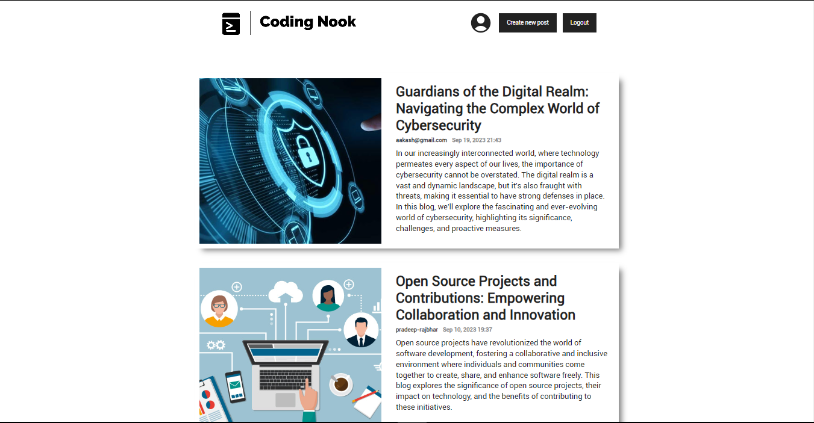

# Blog-Website
- It's a full-stack MERN blog web app with CRUD (CREATE, READ, UPDATE, and DELETE) features. This project is created with Reactjs, Nodejs, Expressjs, JWT, and more to make it dynamic and secure with authentication. I hope you like it.

## Website Preview



<hr/>

## To run this project in your local computer:


1. Clone the project
  ```bash
git clone https://github.com/Aakash-Rajbhar/Blog-Website.git
```

2. Install all packages and dependencies
```bash
   yarn install
```

3. Change the directory and start the project
  ```bash
cd client
yarn start
```
